# Python 

## Package

Das <var>Main Package</var> heißt ```pyquiz```

### pyquiz.app

Sub-Package für die Steuerung der Apps (Shell,GUI, Web)


### pyquiz.api

Sub-Package für den Zugriff auf die HTTP RESTful API von Open Trivia DB


### pyquiz.mock

Sub-Package für den Zugriff auf daten aus dem lokalen Cache (in der APP und für Tests)

### pyquiz.entity

Sub-Package für die Repräsentation der Daten als Entity-Instanzen


## UML - Klassendiagramme

```mermaid
classDiagram
    class Controller{
        + _init__(self, st: streamlit)
        + meta(self, title: str = "", icon: str = "")
        + save_success(self, msg="Daten gespeichert 💾")
    }


```


## Datenstrukturen

Die generelle Datenstruktur welche hier Verwendung findet ist [```pandas.DataFrame```](https://pandas.pydata.org/docs/reference/api/pandas.DataFrame.html)

Aus den JSON-Ressourcen (andere: tbd.) von Open Trivia DB werden ```DataFrames``` erzeugt.

### Motivation

- Robuste und performante Operationen auf Pandas-Datenstrukturen

