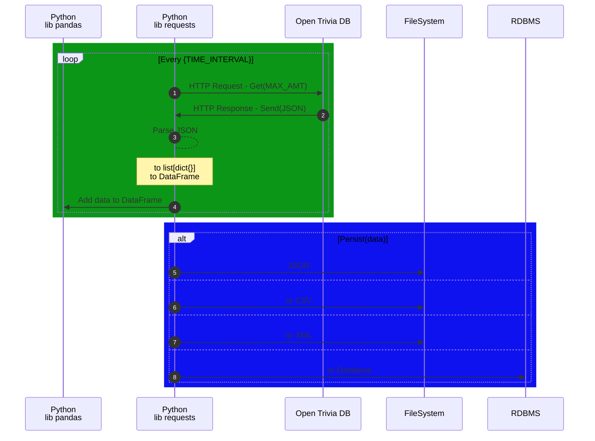

# Scrapy

```mermaid
sequenceDiagram
    autonumber
    participant pd as Python<br/>lib pandas
    participant Py as Python<br/>lib requests
    participant Api as Open Trivia DB
    rect rgb(12, 150, 23)
        loop Every {TIME_INTERVAL}
            
            Py->>Api: HTTP Request - Get(MAX_AMT)
            Api->>Py: HTTP Response - Send(JSON)
            Py-->Py: Parse JSON
            note over Py: to list[dict{}]<br/>to DataFrame
            Py->>pd: Add data to DataFrame
        end
    end
    rect rgb(13, 18, 239)
        alt Persist(data)
            Py->>FileSystem: JSON 
        else 
            Py->>FileSystem: or CSV 
        else 
            Py->>FileSystem: or XML 
        else 
            Py->>RDBMS: or Database 
        end
    end

```