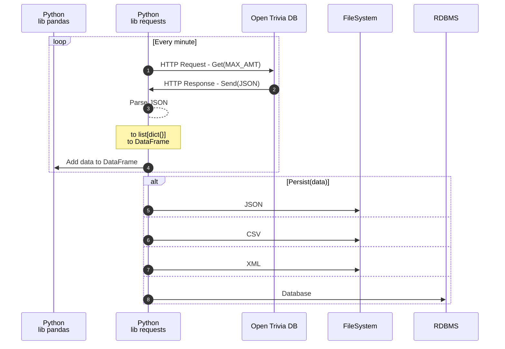

# Scrapy

```mermaid
sequenceDiagram
    autonumber
    participant pd as Python<br/>lib pandas
    participant Py as Python<br/>lib requests
    participant Api as Open Trivia DB
    
    loop Every minute
        Py->>Api: HTTP Request - Get(MAX_AMT)
        Api->>Py: HTTP Response - Send(JSON)
        Py-->Py: Parse JSON
        note over Py: to list[dict{}]<br/>to DataFrame
        Py->>pd: Add data to DataFrame
    end
    alt Persist(data)
        Py->>FileSystem: JSON 
    else 
        Py->>FileSystem: CSV 
    else 
        Py->>FileSystem: XML 
    else 
        Py->>RDBMS: Database 
    end

```