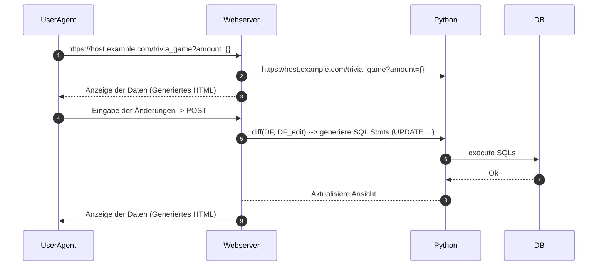

## Anwendung Sequenzdiagramm Beispiel Webversion

```mermaid
sequenceDiagram
    autonumber
    UserAgent->>Webserver: https://host.example.com/trivia_game?amount={}
    Webserver->>Python: https://host.example.com/trivia_game?amount={}
    Webserver-->>UserAgent: Anzeige der Daten (Generiertes HTML) 
    UserAgent->>Webserver: Eingabe der Änderungen -> POST
    Webserver->>Python:  diff(DF, DF_edit) --> generiere SQL Stmts (UPDATE ...) 
    Python->>DB:  execute SQLs
    DB-->>Python: Ok
    Python-->Webserver: Aktualisiere Ansicht
    Webserver-->>UserAgent: Anzeige der Daten (Generiertes HTML) 
```

### <dl>
<dt>UserAgent</dt> 
<dd>HTTP-Client, z.B: Browser</dd>
</dl>

### Auschnitt Quellcode (exemplarisch für Kategorie)

## Screenshots

